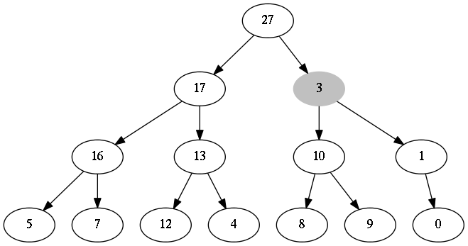

6.2-1
=====
**A**



**B**


**C**


6.2-2
=====
```python
def MIN_HEAPIFY(A, i):
    smallest = i
    l = i.LEFT
    r = i.RIGHT
    if l <= A.heap_size and A[l] < A[smallest]:
        smallest = l
    if r <= A.heap_size and A[r] < A[smallest]:
        smallest = r
    if smallest != i:
        #exchange A[i], A[smallest]
        A[i], A[smallest] = A[smallest], A[i]
        MIN_HEAPIFY(A, smallest)
```

6.2-3
=====
无变化

6.2-4
=====
当 i > A.heap_size/2 时, i是叶子节点, 无变化

6.2-5
=====
```python
def MAX_HEAPIFY_NORECURSION(A, i):
    largest = i
    l = i.LEFT
    r = i.RIGHT

    while l <= A.heap_size or r <= A.heap_size:
        if l <= A.heap_size and A[l] > A[largest]:
            largest = l
        if r <= A.heap_size and A[r] > A[largest]:
            largest = r
        if largest == i:
            break
        A[i], A[largest] = A[largest], A[i]
        i = largest
        l = i.LEFT
        r = i.RIGHT
```

6.2.6
=====
因为 T(n) <= T(2n/3) + Θ(1)
n^(logb(a))=n^(log3/2(1))=n^0=1=f(n)

因此: 根据主定理的情况二得

T(n) <= Θ(lg(n))

所以最坏运行时间为: Ω(lg(n))

